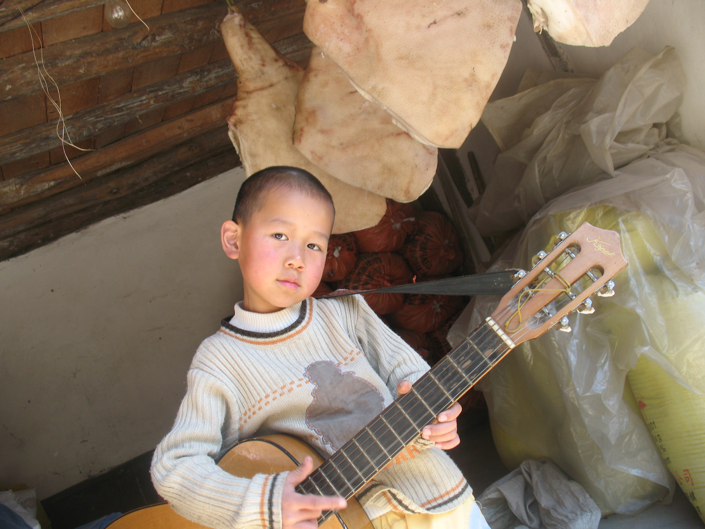
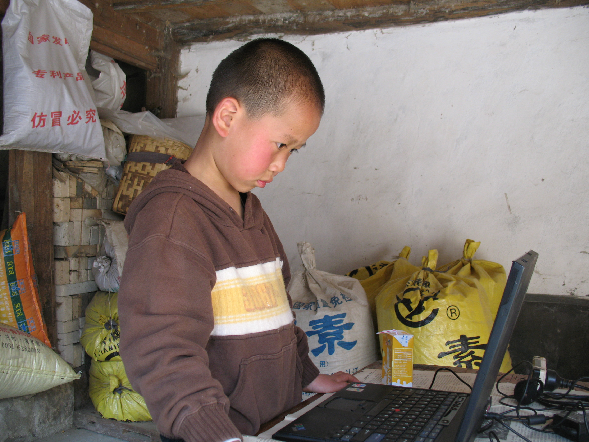
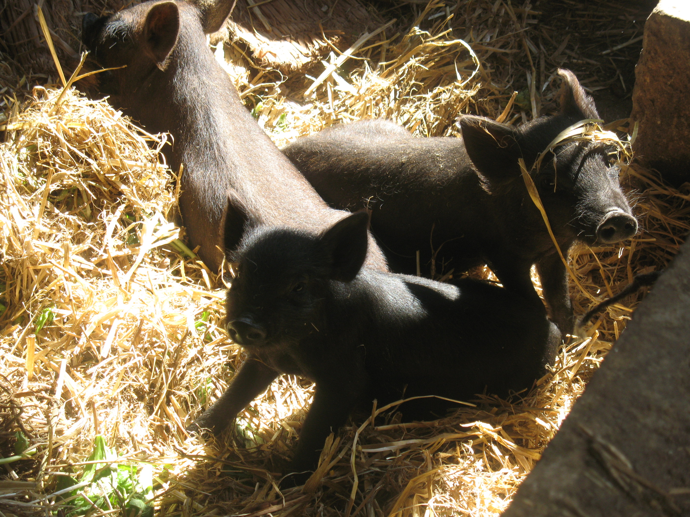
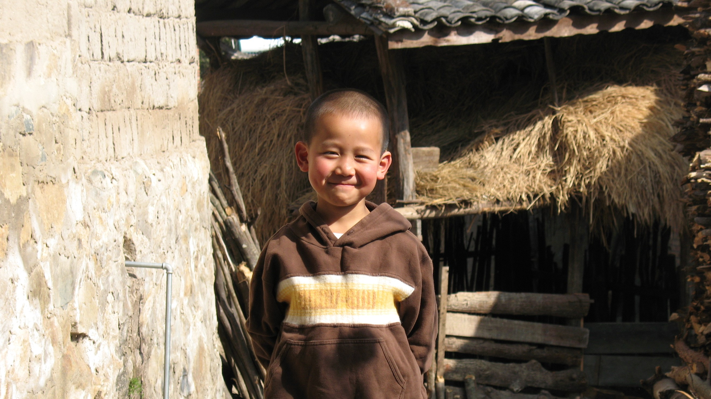

---
title: "些许童年回忆"
date: 2023-03-17T09:32:01+08:00
draft: false
authors: ["WJG"]
description: "从当前这个宇宙穿越回当初"

featuredImage: "logo.jpg"

tags: ["童年", "回忆","趣事"]
categories: ["回忆"]

lightgallery: true
---

从当前这个宇宙穿越回当初
<!--more-->

​	     时间跨度似乎有点大，不知从何说起，我幼儿园上过两所，小学上过两所，生于一个偏远的小乡里，那里是我的老家，一个从县城出去还有八十公里三个小时的山路，对于小时候晕车的我那条路简直是噩梦一般的存在，在二十世纪初，我在那里的乡镇卫生院里出生了，度过了两年混沌的时光，开始慢慢有了一些记忆。

​        在老家的时间不是很多，多数时候都是过年过节才会回去，在老家的院子里我早早的就接触到了篮球🏀，吉他 :guitar: 以及~~编程~~ （玩电脑）:computer:

小吉他手

 小程序员

喔对了我还是小摄影师，现在还记得我当时最引以为豪的摄影作品我愿将其称之为 **《黑猪》**

同时也留下了很多帅照，**多图预警!**

个人logo的来源，笑得有点治愈😊，活脱脱一个阳光大男孩😎

