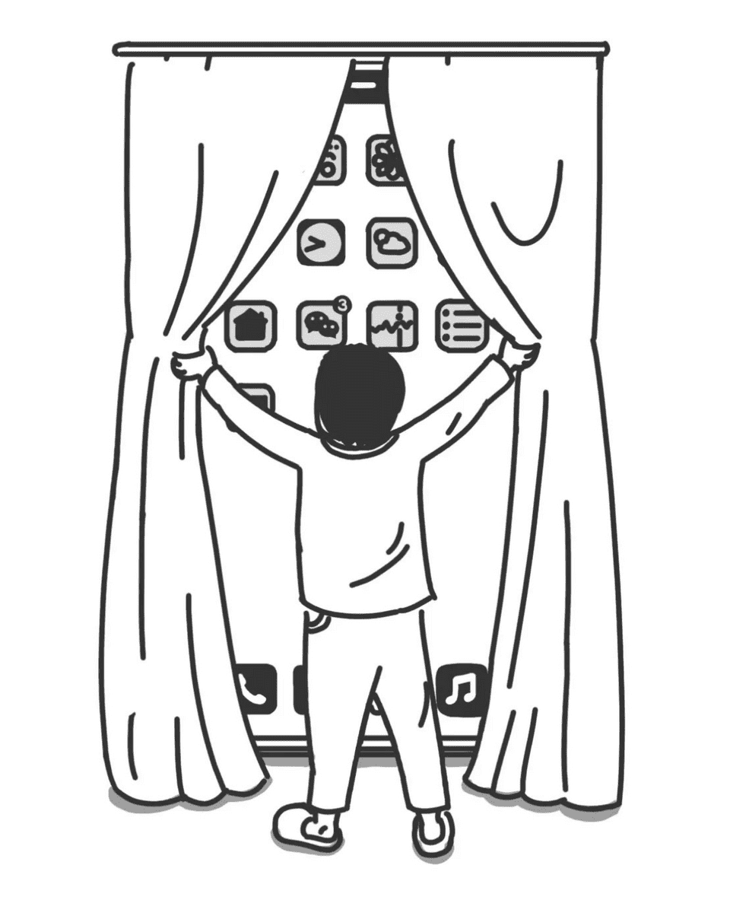

### 「生命是一桩太好的东西，好到你无论选择什么方式度过，都像是一种浪费。」----张晓风

---

#### 每天早上起来第一件事就是打开窗

---

#### 每天下班后唯一的运动    
-----[脑洞没边儿](https://juuun.io/)

---

## 书信结尾敬辞

春：春安；夏:夏祺；秋：秋绥;冬：冬禧

顺颂时祺/绥：祝你时时吉祥，时时健康

顺祝商祺：祝你经商顺利，吉祥如意

敬请春安 即颂春祺 并颂春禧 顺候夏址

此颂暑安 即候夏安 即请秋安 顺颂秋祺

并请秋安 敬颂冬绥 此请炉安 即请冬安

---

### 关于时间

#### 时间的褶皱

时间更像一方羊皮卷，皱皱巴巴得叠在一起，而不是像一张洁白无暇的大纸。假如我们把赶地铁的时间当作“平的”或是“线性的”，那么在等红绿灯的二十秒钟就是被褶皱的：你什么也不能做，只能等着，等我们从时间的褶皱里爬出来继续直线前行。

人生中的任何一段时光并不是刚性约束，也不一定要有100%的明确规划地工作或产出才有意义，娱乐和闲暇也同样有意义，其价值完全取决于自我需求与自我定位。

------ [少数派《不止低头刷手机，用输出和思考陪伴两小时通勤路》](https://sspai.com/post/79000)

---

