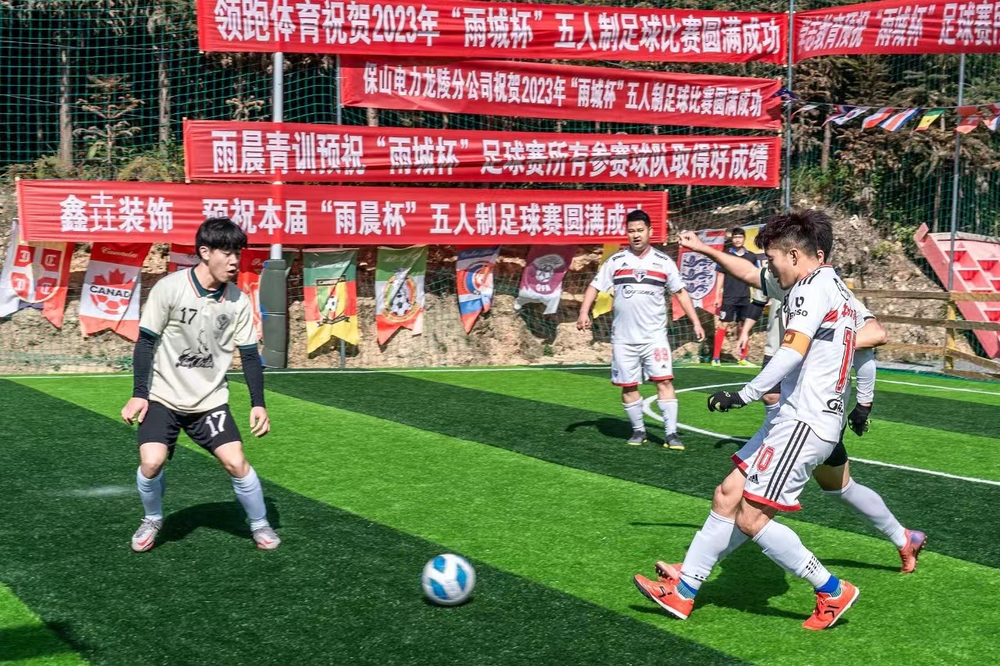

此刻是晚上十一点，从龙陵回到保山，喝了几杯茶洗了一个舒舒服服的澡坐在书桌前，心情大好，决定写下一篇blog记录一下此次的龙陵足球之旅。

### 决赛

#### 两球落后扳平
下午四点，太阳落下了一些，但仍旧有些刺眼，我拖着一场废的右腿蹲在替补席，开场一分钟不到便被对方连入两球，场上场下都有些蒙，我听到了后面的大叔叹气到：“唉，不有瞧常咯”，另外一边又传出“加油！加油！”，充满了讽刺意味地学我们队在场上的呼喊声，场上场下都有些蒙，此时球队大哥61第一个站了出来，中圈开球趟了一步直挂死角2：1，咬住了比分，撕扯了一段时间后我们门将直接将球扔进对面禁区，对方门将小黄一个手滑将球自己送入球门，乌龙2：2，比赛又回到了同一起跑线，此时我也替补上场，只可惜我的上场并没有起到多大作用，对方通过两次边线球配合打进两球4：2，上半场哨响.
中场休息时大家并没有泄气，将自己的想法说出来，发现对方的特点同时找出自己的不足，相互打气：“就两个球，加油干！”

#### 三球落后扳平
我们带着两球落后进入下半场，开场不久我们的拖后23在头球解围时受到干扰后蹭乌龙5：3，面对三球落后的局面,大家都觉得胜算不大了，只希望不要比分继续扩大，我潜意识里也这么觉得，但这么多年踢球的习惯或是拼劲让我们继续相互鼓励呼喊“没事没事，继续打！”，没有泄气我们加强进攻打了出去，功夫不负有心人，在一次角球进攻中我们也学到对方的战术禁区里制造混乱后弧顶一脚直挂死角，追回一球！我们继续相互鼓励，一边加强进攻，一边抵御对手的凶猛攻势。在一次队友赢下球权后，我持球反击面对两名防守，带了一步再往左一趟很舒服的位置想着左脚抡一脚，快接近门前时在队友小智身上一个变线弹入球门5：4！“还有一个球！！！”我大喊，大家也都拿出了十足的拼劲，时间一分一秒的过去，专注于比赛进入了心流的感觉，奇迹出现了，我们守门员大力手抛球划过一个美丽的弧线打到了对面门柱的下沿落地，我见机冲上前赶在门将之前将球捅进，扳平了！！！我激动的振臂庆祝，全场都沸腾了，我冲到替补席激动的跳起来，我仿佛从来没有跳的那么高过，你怎能不爱足球！但比赛没有结束，对方不甘心就这样被我们打平，更猛烈的进攻，大家一起顽强防守等到了终场哨的吹响。
尽管最后点球憾负，赛前告诉自己不留遗憾，但大家都拼尽全力，能扳平已算是不留遗憾了，只可惜点球经验欠缺一些，与冠军失之交臂，现在想想我们离冠军如此之近，就像世界杯决赛的阿根廷和法国，谁又能没有遗憾呢。

### 故事的开始

机缘巧合中小智和我说起龙陵会有比赛约着一起踢，我打趣地说有啦啦队就来，我心里其实还是蛮期待的，诸多原因,首先我是龙陵人在龙陵长大，与小智（盐巴）、张羽鹤（兜兜）是龙山小学同班同学因为踢球一直都有些联系.其次是与琨琨一起踢球三四年还没有并肩战斗参加过比赛还有一个是我初中刚踢球时到龙陵参加了保山市首届五人制比赛，代表六中代表隆阳同样与冠军失之交臂所以回到龙陵参加这次比赛，虽说随便玩玩，但细想也颇有意义。

### 小组赛
没有好好磨合第一场面对TNT6：0，相当于让出小组第一，要想出线就必须全胜，深巷虫虫也是非常强劲的对手，我们靠着fans的英勇发挥成功拿下，后面差距较大的比赛中我们慢慢磨合，最后一场面对另外一个强劲的对手实况8，在落后一球的情况下连扳三球成功出线。

### 半决赛
B组小组第一鑫垚装饰同样是一个很强劲的对手，双方都将球权让出，放弃前场的逼抢导致上半场一直处于白热化，下半场我与61一个边线球的小配合，闪开角度左脚抢射打破僵局，突发奇想比出嘘的手势庆祝，随后接fans挑球凌空抽射直挂右上角锁定胜局成功进军决赛。
